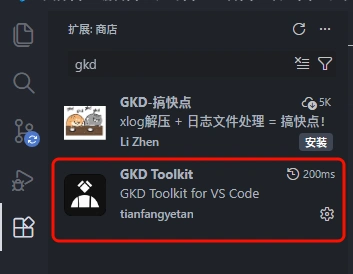
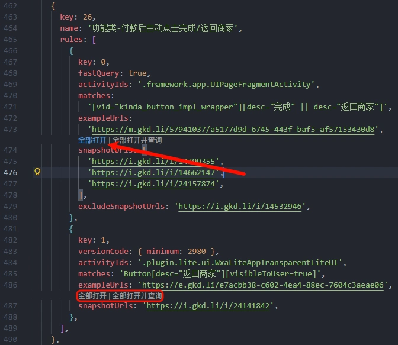
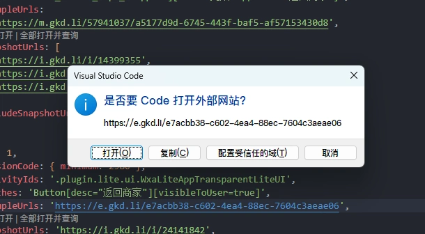
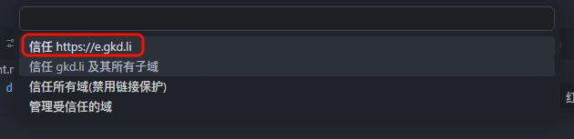

# GKD Toolkit

[GKD 订阅项目](https://github.com/gkd-kit/subscription-template) 的 VS Code 扩展。

## 功能

- 打开所有快照

  - 同时查询选择器

## 启用条件

1. 当前工作区安装以下 npm 包

   - `@gkd-kit/api`
   - `@gkd-kit/define`
   - `@gkd-kit/tools`

2. 当前编辑器打开了 `src` 或者 `src/apps` 文件夹下的 `.ts` 文件

3. 当前编辑器文件导入了 `defineGkdApp` 或者 `defineGkdGlobalGroups` 函数

## 使用方法

1. 前往vs code 扩展市场安装 `GKD Toolkit` 扩展
  

2. 返回代码会出现`snapshotUrls`快照/组上方会出现`全部打开|全部打开并查询`
   

3. 首次使用会出现`是否要Code打开外部网站?`请允许
   

>WARNNING
>
> 请最好配置受信任的域，否则会在打开多条链接出现每条链接都需要用户手动同意安全确认情况

